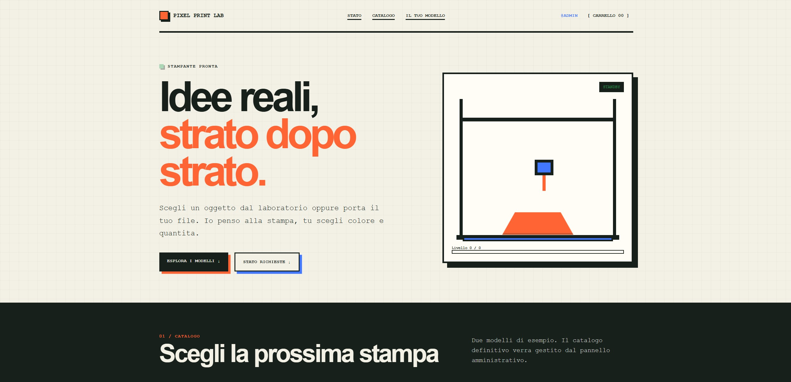
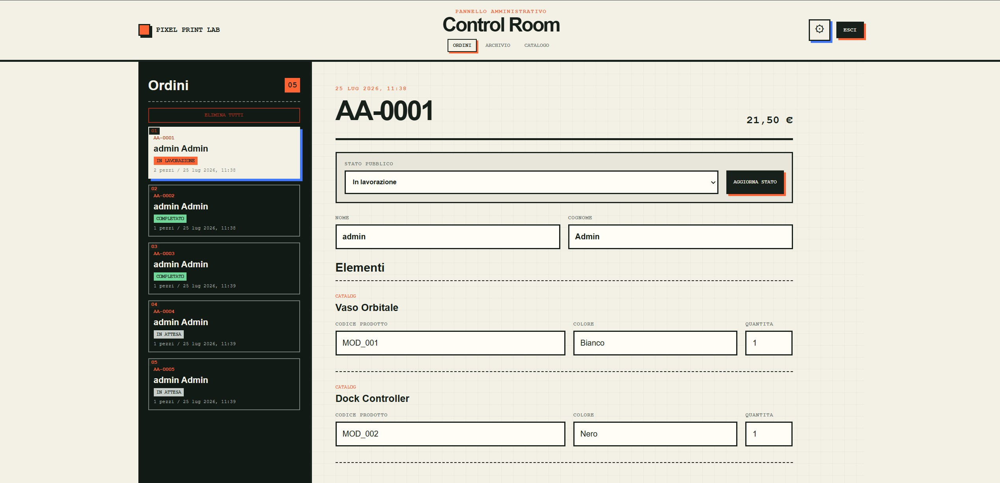

# Pixel Print Lab

[](https://github.com/Moffoletta/pixel-print-lab/actions/workflows/test.yml)
[](https://github.com/Moffoletta/pixel-print-lab/releases/latest)
[](LICENSE)

**Applicazione personale per raccogliere richieste di stampa 3D.**  
Gli amici possono scegliere un modello dal catalogo o caricare un file STL/3MF, selezionare colore e quantita, e inviare una richiesta. Tu gestisci tutto dalla Control Room.



## Indice

- [Caratteristiche](#caratteristiche)
- [Screenshot](#screenshot)
- [Quick start](#quick-start)
- [Avvio con Docker](#avvio-con-docker)
- [Configurazione](#configurazione)
- [Persistenza e backup](#persistenza-e-backup)
- [Pubblicazione con Cloudflare Tunnel](#pubblicazione-con-cloudflare-tunnel)
- [API locali](#api-locali)
- [Documentazione](#documentazione)
- [Release e licenza](#release-e-licenza)

## Caratteristiche

- **Catalogo pubblico** con prodotti, colori e visualizzatore 3D per STL.
- **Richieste ospiti o con account**: chi vuole puo ordinare subito, chi crea un account trova lo storico personale.
- **Upload di modelli personali**: file STL o 3MF fino a 50 MB, oppure link esterni da piattaforme supportate.
- **Tracking pubblico**: ogni richiesta ha un codice univoco e uno stato visibile a tutti (`in attesa`, `in lavorazione`, `completato`, `consegnato`).
- **Control Room**: pannello amministrativo per gestire ordini, catalogo, colori e impostazioni.
- **Notifiche email**: avviso opzionale a ogni nuovo ordine via SMTP.
- **Sicurezza di base**: autenticazione con sessioni, rate limit, header di sicurezza e CSP.

## Screenshot

### Home pubblica


### Control Room



## Quick start

Requisiti: Node.js 22+, npm, Git.

```powershell
npm.cmd install
npm.cmd run db:setup
npm.cmd run dev
```

Apri `http://localhost:3000`. Il pannello amministrativo e su `http://localhost:3000/admin.html`.

Imposta `ADMIN_USERNAME` e `ADMIN_PASSWORD` nel file `.env` prima di accedere alla Control Room.

## Test

```powershell
npm.cmd test
```

## Avvio con Docker

Sono richiesti Docker Engine con Compose o Docker Desktop.

```sh
docker compose pull
docker compose up -d
docker compose ps
```

Il primo avvio applica le migrazioni SQLite e inserisce il catalogo dimostrativo. L'applicazione e disponibile su `http://localhost:3000`.

### Configurazione

Copia `.env.example` in `.env` e compila le variabili necessarie. Il Compose carica automaticamente `.env` tramite `env_file`.

| Variabile | Valore predefinito | Uso |
| --- | --- | --- |
| `ADMIN_USERNAME` | nessuno | Nome utente amministrativo iniziale |
| `ADMIN_PASSWORD` | nessuno | Password amministrativa iniziale |
| `TRUST_PROXY` | `false` | `true` dietro un reverse proxy HTTPS fidato |
| `PORT` | `3000` | Porta interna del container |
| `DATABASE_PATH` | `/app/data/pixel-print-lab.db` | Percorso SQLite nel container |
| `UPLOAD_DIRECTORY` | `/app/storage/uploads` | Upload temporanei |
| `ORDER_FILE_DIRECTORY` | `/app/storage/orders` | Modelli associati agli ordini |
| `CATALOG_DIRECTORY` | `/app/storage/catalog` | Asset amministrativi del catalogo |
| `SMTP_HOST` | vuoto | Host del server SMTP |
| `SMTP_PORT` | `587` | Porta SMTP |
| `SMTP_SECURE` | `false` | `true` per TLS diretto, normalmente sulla porta 465 |
| `SMTP_USER` | vuoto | Utente SMTP facoltativo |
| `SMTP_PASSWORD` | vuoto | Password SMTP, richiesta insieme all'utente |
| `SMTP_FROM` | vuoto | Mittente delle notifiche |
| `SMTP_TO` | vuoto | Destinatario delle notifiche ordine |

L'invio email e disattivato per impostazione predefinita. Dopo aver configurato SMTP, apri la Control Room, seleziona la rotella e attiva "Email nuovi ordini". Un errore SMTP viene registrato ma non annulla un ordine gia salvato.

## Persistenza e backup

I named volumes `pixel-print-lab-data` e `pixel-print-lab-storage` conservano database, ordini e asset. I dati persistono dopo `docker compose down` o la ricostruzione del container.

Backup coerente:

```sh
docker compose stop
docker compose run --rm --no-deps --entrypoint tar app -czf - -C /app data storage > pixel-print-lab-backup.tar.gz
docker compose start
```

Per aggiornare:

```sh
git pull
docker compose pull
docker compose up -d
```

## Pubblicazione con Cloudflare Tunnel

`compose.cloudflare.yml` pubblica l'applicazione tramite Cloudflare Tunnel senza esporre la porta 3000 sul NAS. `TRUST_PROXY` viene attivato automaticamente.

1. Aggiungi un dominio a Cloudflare e crea un tunnel.
2. Configura un hostname pubblico HTTPS con servizio di origine `http://app:3000`.
3. Copia `.env.cloudflare.example` in `.env`, inserisci credenziali amministrative e `TUNNEL_TOKEN`.
4. Avvia:

   ```sh
   docker compose -f compose.cloudflare.yml pull
   docker compose -f compose.cloudflare.yml up -d
   ```

## API locali

- `GET /api/products`: prodotti visibili.
- `GET /api/products/:id`: dettaglio di un prodotto.
- `GET /api/colors`: colori attivi.
- `POST /api/custom-models/upload`: caricamento temporaneo e ispezione di un file STL o 3MF.
- `POST /api/custom-models/link`: validazione di un link esterno.
- `DELETE /api/custom-models/:id`: eliminazione di un upload temporaneo.
- `POST /api/orders`: creazione di una richiesta persistente.
- `GET /api/orders`: elenco pubblico limitato a codice richiesta e stato.
- `/api/account/*`: registrazione, login, logout, sessione, storico personale e cambio password.
- `/api/admin/*`: autenticazione e gestione protetta di richieste, prodotti, asset, colori, impostazioni e credenziali amministrative.

## Documentazione

- [`docs/ROADMAP.md`](docs/ROADMAP.md): Kanban e avanzamento.
- [`docs/ARCHITETTURA.md`](docs/ARCHITETTURA.md): schema grafico, componenti e flussi.
- [`docs/guida-progetto.md`](docs/guida-progetto.md): guida tecnica progressiva.
- [`CHANGELOG.md`](CHANGELOG.md): modifiche incluse nelle versioni pubblicate.
- [`CONTRIBUTING.md`](CONTRIBUTING.md): come contribuire.
- [`SECURITY.md`](SECURITY.md): come segnalare problemi di sicurezza.

## Release e licenza

Le versioni stabili sono pubblicate nella pagina [Releases](https://github.com/Moffoletta/pixel-print-lab/releases). I tag seguono il versionamento semantico e generano automaticamente l'immagine Docker su `ghcr.io/moffoletta/pixel-print-lab`.

Il progetto e distribuito con licenza [MIT](LICENSE).
